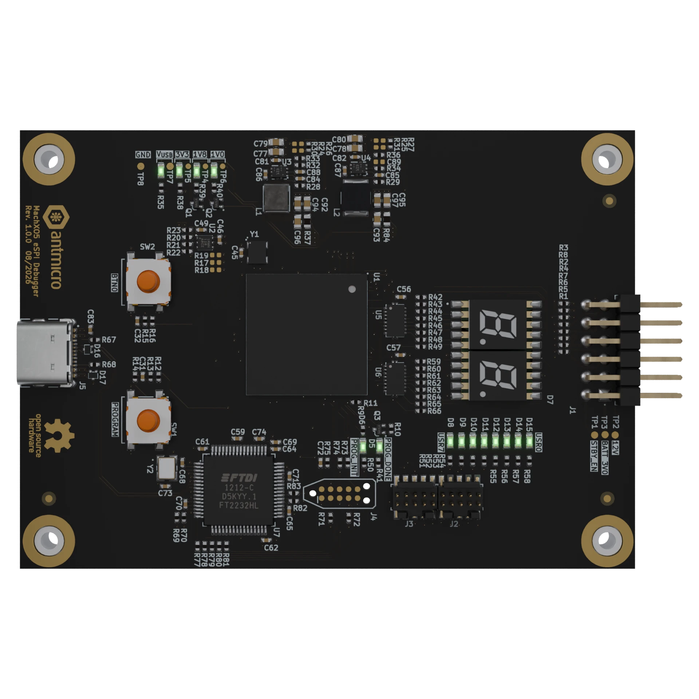

# MachXO5 eSPI Debugger

Copyright (c) 2026 [Antmicro](https://www.antmicro.com)

## Overview

This project contains open hardware design files for an FPGA-based debug board built around the Lattice MachXO5-NX FPGA.
The board is designed to aid the process of development, bring-up and integration of eSPI-based connections to Data Center Secure Control Modules (DC-SCMs).
It provides USB-accessible UART and JTAG interfaces and a Port 80 status display, enabling development, testing and debugging of eSPI communication before integration into a target server platform.
This project includes only PCB design files - as dedicated bitstream needs to be generated for the on-board Lattice FPGA in order to make it work.
The PCB design files were prepared in KiCad 10.x.

## Key features

* Lattice [MachXO5-NX LFMXO5-25-7BBG400C](https://www.latticesemi.com/en/Products/FPGAandCPLD/MachXO5-NX) FPGA
* Generic 0.1 inch pinhead connector for interfacing with HPM subsystem
* USB-C port with FTDI FT2232H USB interface bridge
* UART and JTAG interfaces accessible from the USB interface bridge
* Port 80 status display with LED indicators
* 125 MHz on-board clock source
* 62 x 87 mm (2.44 x 3.42 inch) PCB outline

## Project structure

The main directory contains KiCad PCB project files, the LICENSE, and this README, and the img directory contains graphics for this README.

## License

This project is licensed under the [Apache-2.0](LICENSE) license.
